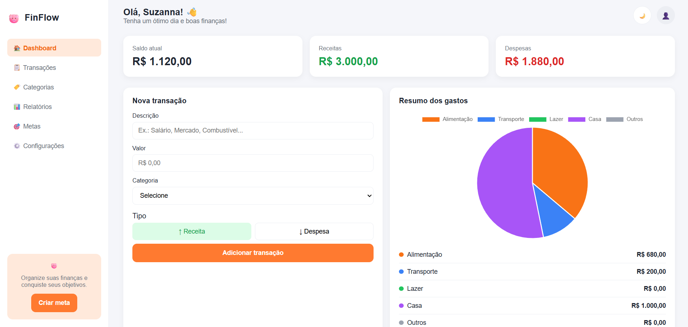
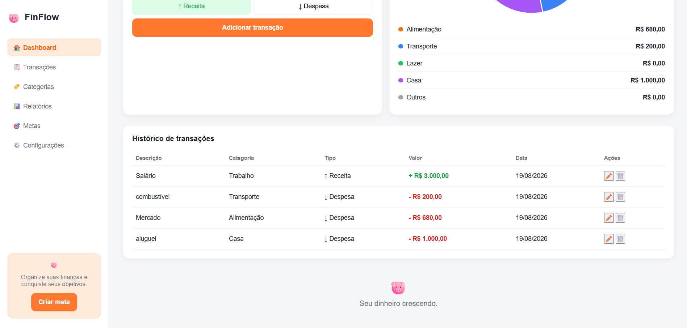

# 🐷 FinFlow

Dashboard financeiro desenvolvido em **HTML, CSS e JavaScript** durante meus estudos, com foco no controle de receitas e despesas, organização das transações e visualização do resumo financeiro.

## ✨ Funcionalidades

* Cadastro de transações com descrição, valor, categoria e tipo
* Edição de transações
* Exclusão de transações
* Cálculo automático de saldo, receitas e despesas
* Resumo dos gastos agrupado por categoria
* Histórico de transações
* Dados armazenados no navegador com `localStorage`
* Persistência dos dados mesmo após recarregar a página
* Modo claro/escuro
* Interface responsiva para diferentes tamanhos de tela

## 🛠️ Tecnologias

* HTML5
* CSS3
* JavaScript (puro, sem frameworks)
* LocalStorage

## 📂 Estrutura do projeto

```text
FinFlow/
├── css/
│   ├── responsive.css
│   ├── style.css
│   └── variables.css
├── js/
│   ├── app.js
│   ├── storage.js
│   ├── transactions.js
│   └── ui.js
└── index.html
```

## 💾 Armazenamento

O FinFlow utiliza o **LocalStorage** do navegador para armazenar as transações. Dessa forma, os dados permanecem disponíveis mesmo quando a página é recarregada.

## ▶️ Como executar o projeto

1. Baixe ou clone este repositório.
2. Abra a pasta do projeto no VS Code.
3. Abra o arquivo `index.html` no navegador.
4. Também é possível utilizar a extensão **Live Server** no VS Code.

## 🚧 Status

**Em desenvolvimento.**

O FinFlow é um projeto de estudo e portfólio que estou desenvolvendo gradualmente para praticar **HTML, CSS, JavaScript, manipulação do DOM, organização de código e armazenamento de dados no navegador**.

Novas funcionalidades e melhorias serão adicionadas conforme o desenvolvimento do projeto avança.

## 🖥️ Representação visual

### ☀️ Dashboard — modo claro



### 🌙 Dashboard — modo escuro


### 💳 Gerenciamento de transações


---

👩‍💻 **Projeto desenvolvido por Suzanna Dias**
